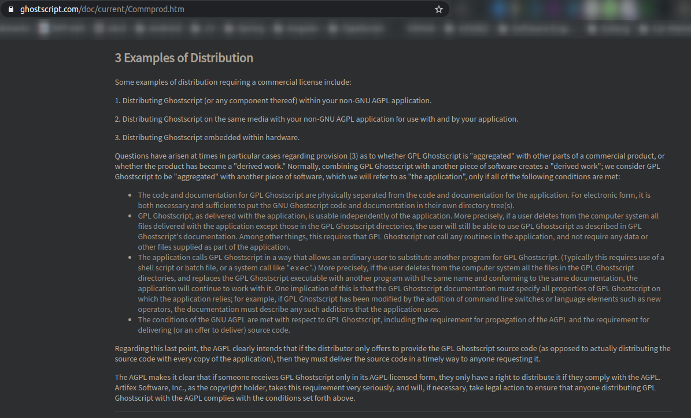
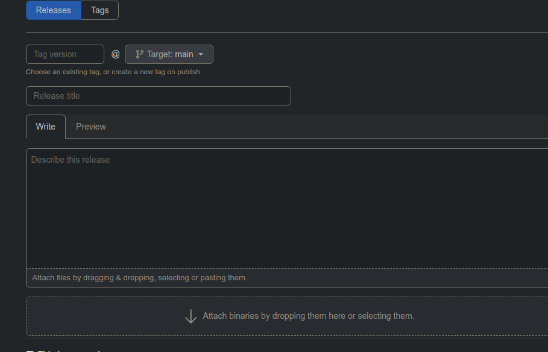
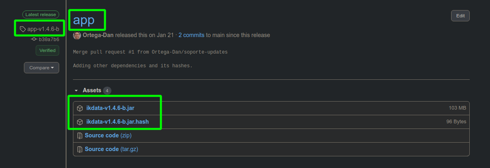
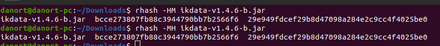

# On Licensing things:

* **Gostscript must NOT be distributed in the same media as the application using it, because of its AGPL and their clarification of it**\
Find more information here\

Which is found on section 3 in here: https://www.ghostscript.com/doc/current/Commprod.htm.
And the AGPL v3 can be found here: https://github.com/Ortega-Dan/aGPLlicenseReader/blob/main/LICENSE \
(For PDF support, the end user can use any PostScript interpreter of their choice given the executable is found in the path and its name is gswin64c.exe, or the user can follow the optional recomendation 4 paragraph instructions by GraphicsMagick prerequisites from: http://www.graphicsmagick.org/INSTALL-windows.html#prerequisites)

* ImageMagick can be distributed, and must include notice and a copy of the licence, it is derived of Apache 2.0, for the specifics its license is here:
https://imagemagick.org/script/license.php

* Tesseract is distributed under the actual Apache 2.0 license, which allows for closed source distribution, and must include notice and a copy of the licence. For the specifics its licence is here:
https://github.com/tesseract-ocr/tesseract/blob/master/LICENSE

* GraphicsMagick is distributed with the permision of the MIT license, which requires notice and a copy of the license, for the specifics see: 
https://opensource.org/licenses/MIT

* ZbarImg (Zbar) is distributed under LGPL licence v2.1 which allows for distribution of closed source apps that just link or use Zbar, but require distribution of licence and source code **OF ZBAR**, for the specifics:
http://www.gnu.org/licenses/old-licenses/lgpl-2.1.html \
(info and sources of zbar are found, depending on the version, here https://github.com/mchehab/zbar \
or here https://sourceforge.net/projects/zbar/)

____________________________________________________________________

# Legacy info:

App releases were published as:

(release title must always be app, and tag version must be the version preceded by 'app-v')

Naming of jars must be as follows

___

For all hashes, those are MD5 and SHA1 respectively

as produced by rhash -HM package.extension\
e.g:

