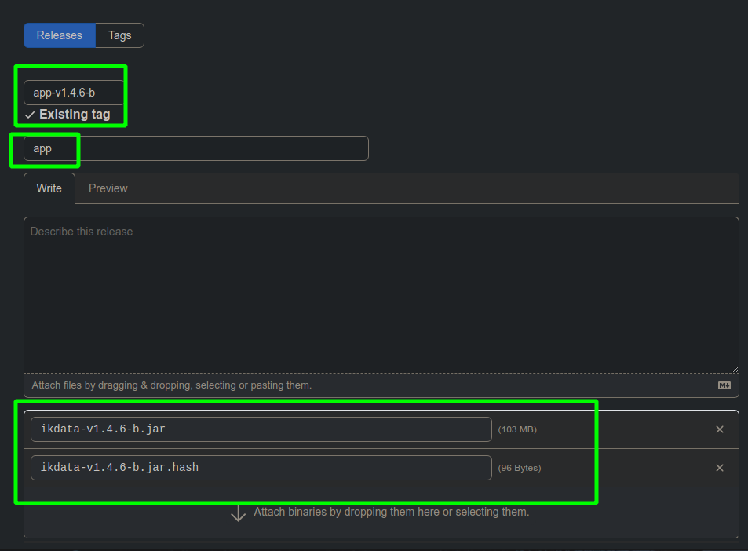
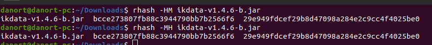

# Legacy info:

App releases were published as:

(release title must always be app, and tag version must be the version preceded by 'app-v')

Naming of jars must be as follows

____________________

For all hashes, those are MD5 and SHA1 respectively.

As produced by rhash -HM package.extension:\
